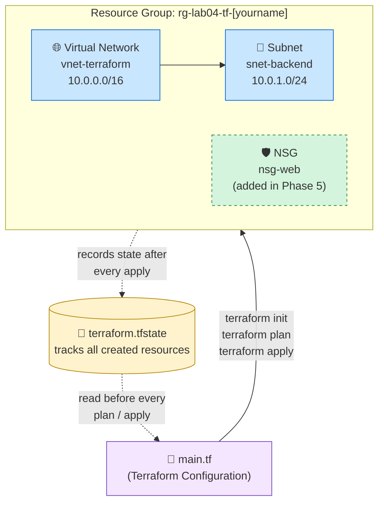

# Lab 4: Infrastructure as Code with Terraform

**Platform:** Microsoft Azure (Cloud Shell)

**Loom Video Link**
https://www.loom.com/share/6c1bfa5ec8ff432381fe44645cc58827

---

## 📌 Overview

This lab replaces manual, click-through provisioning in the Azure Portal with **Infrastructure as Code (IaC)** using **Terraform**. A single configuration file (`main.tf`) declares the desired end state of the environment, a Resource Group, Virtual Network, and Subnet, and Terraform handles the steps needed to build it, track it, update it, and tear it down.

**Key concepts practiced:**
- Declarative infrastructure ("what," not "how")
- The Terraform core workflow: `init`, `plan`, `apply`, `destroy`
- State management via `terraform.tfstate`
- Incremental change detection (Terraform only touches what changed)
- Dependency resolution between resources

---

## 🏗️ Architecture Diagram



**The flow:** `main.tf` declares the desired resources. Running `terraform apply` builds them in dependency order (Resource Group, then VNet, then Subnet) and records the result in `terraform.tfstate`. On every subsequent `plan` or `apply`, Terraform compares the configuration against that state file and only changes what's different, as demonstrated in Phase 5 when the NSG is added without touching anything else.

---

## ✅ Prerequisites

- [ ] Active Azure subscription
- [ ] Access to the Azure Portal (`portal.azure.com`)
- [ ] No local installation required, this lab runs entirely in Azure Cloud Shell, which has Terraform pre-installed

---

## 🏷️ Naming Conventions & Variables

| Resource | Name | Notes |
|---|---|---|
| Resource Group | `rg-lab04-tf-[yourname]` | Replace `[yourname]` with your first name, lowercase |
| Virtual Network | `vnet-terraform` | `10.0.0.0/16` |
| Subnet | `snet-backend` | `10.0.1.0/24` |
| NSG (Phase 5) | `nsg-web` | Added to the live environment mid-lab |
| Location | `Central US` | |

---

## 🧠 Core Concepts (Read Before Starting)

| Concept | What it means |
|---|---|
| **Declarative infrastructure** | You describe the desired end state ("a resource group named X exists"); Terraform figures out how to get there. |
| **State file (`terraform.tfstate`)** | Terraform's record of everything it has created. It's read before every `plan`/`apply` so Terraform knows what already exists. Never delete or hand-edit it. |
| **The four core commands** | See table below, always run in this order. |

| Command | Purpose | When to run it |
|---|---|---|
| `terraform init` | Downloads the Azure provider plugin | Once per project, first step |
| `terraform plan` | Previews changes with no side effects | Before every `apply`, never skip |
| `terraform apply` | Executes the plan, requires typing `yes` | After reviewing the plan |
| `terraform destroy` | Removes every resource tracked in state | When tearing down the environment |

---

## 🚀 Step-by-Step Instructions

### Phase 1 — Open Cloud Shell

1. Sign in at `portal.azure.com`.
2. Click the `>_` icon in the top-right toolbar to open **Cloud Shell**.
   - First time: a setup panel prompts you to configure storage. Select your subscription, leave defaults, click **Create** (one-time, ~60 seconds).
3. Confirm the shell mode dropdown reads **Bash**, not PowerShell.
4. Create and enter a project folder:
   ```bash
   mkdir terraform-lab
   cd terraform-lab
   ```

### Phase 2 — Write the Configuration

1. Open the built-in editor:
   ```bash
   code main.tf
   ```
2. Paste in the full configuration below. It declares the `azurerm` provider, a Resource Group, a Virtual Network, and a Subnet:

   ```hcl
   # ── 1. Tell Terraform which provider to use ──────────────────────────
   terraform {
     required_providers {
       azurerm = {
         source  = "hashicorp/azurerm"
         version = "~> 3.0"
       }
     }
   }

   provider "azurerm" {
     features {}
   }

   # ── 2. Resource Group ─────────────────────────────────────────────────
   # CHANGE "yourname" below to your own first name.
   resource "azurerm_resource_group" "rg" {
     name     = "rg-lab04-tf-yourname"   # <-- CHANGE THIS
     location = "Central US"
   }

   # ── 3. Virtual Network ────────────────────────────────────────────────
   resource "azurerm_virtual_network" "vnet" {
     name                = "vnet-terraform"
     location            = azurerm_resource_group.rg.location
     resource_group_name = azurerm_resource_group.rg.name
     address_space       = ["10.0.0.0/16"]
   }

   # ── 4. Subnet ─────────────────────────────────────────────────────────
   resource "azurerm_subnet" "subnet" {
     name                 = "snet-backend"
     resource_group_name  = azurerm_resource_group.rg.name
     virtual_network_name = azurerm_virtual_network.vnet.name
     address_prefixes     = ["10.0.1.0/24"]
   }
   ```

3. **Critical:** change `rg-lab04-tf-yourname` to your own first name before saving. If left as a placeholder that someone else has already used, the apply will fail.
4. Save (`Ctrl+S`), then close the editor (`Ctrl+Q`).
5. Confirm the file saved correctly:
   ```bash
   cat main.tf
   ```

> **Why the dependency order matters:** referencing `azurerm_resource_group.rg.location` and `azurerm_resource_group.rg.name` inside the VNet block creates an implicit dependency, Terraform will always create the resource group first, automatically.

### Phase 3 — Deploy: The Terraform Workflow

1. **Initialize:**
   ```bash
   terraform init
   ```
   Downloads the Azure provider into a hidden `.terraform` folder and locks the version in `.terraform.lock.hcl`. Look for `Terraform has been successfully initialized!`

2. **Plan:**
   ```bash
   terraform plan
   ```
   Read-only preview. Confirm the output ends with:
   ```
   Plan: 3 to add, 0 to change, 0 to destroy.
   ```

3. **Apply:**
   ```bash
   terraform apply
   ```
   Type the full word `yes` when prompted (not `y`), this is a deliberate safety mechanism. Watch each resource move through `Creating...` → `Creation complete` in dependency order. Confirm:
   ```
   Apply complete! Resources: 3 added, 0 changed, 0 destroyed.
   ```
   Terraform writes `terraform.tfstate` at this point, its record of what now exists.

### Phase 4 — Verify in the Azure Portal

1. Minimize Cloud Shell and navigate to **Resource groups → rg-lab04-tf-[yourname]**.
2. Confirm `vnet-terraform` and its subnet are listed.
3. Open `vnet-terraform` → **Subnets** and confirm `snet-backend` shows address prefix `10.0.1.0/24`.

### Phase 5 — Add a Resource to a Live Environment

This phase demonstrates Terraform's incremental change detection, adding one resource without touching anything already deployed.

1. Reopen the editor: `code main.tf`.
2. Scroll to the bottom (past the subnet block's closing `}`) and append the following new block. Don't modify any existing code:

   ```hcl
   # ── 5. Network Security Group ────────────────────────────────────────
   resource "azurerm_network_security_group" "nsg" {
     name                = "nsg-web"
     location            = azurerm_resource_group.rg.location
     resource_group_name = azurerm_resource_group.rg.name
   }
   ```

3. Save (`Ctrl+S`), close (`Ctrl+Q`).
4. **Plan again:**
   ```bash
   terraform plan
   ```
   Confirm the output shows:
   ```
   Plan: 1 to add, 0 to change, 0 to destroy.
   ```
   This is the key insight, Terraform compares the updated config against the state file, sees the RG, VNet, and Subnet are unchanged, and determines only the NSG needs creating.
5. **Apply:**
   ```bash
   terraform apply
   ```
   Type `yes`. Confirm:
   ```
   Apply complete! Resources: 1 added, 0 changed, 0 destroyed.
   ```
6. Refresh the resource group in the portal, four resources should now appear.

### Phase 6 — Destroy: Clean Up Everything

1. Run:
   ```bash
   terraform destroy
   ```
2. Confirm the plan shows all four resources scheduled for removal:
   ```
   Plan: 0 to add, 0 to change, 4 to destroy.
   ```
3. Type `yes` when prompted. Confirm:
   ```
   Destroy complete! Resources: 4 destroyed.
   ```
4. Verify in the portal that `rg-lab04-tf-[yourname]` no longer appears (wait 30 seconds and refresh if needed).

> **Always use `terraform destroy` instead of deleting resources manually in the portal.** Manual deletion leaves the state file out of sync, the next `plan` will error because Terraform believes those resources still exist.

---

## 🛠️ Troubleshooting

| Issue | Cause | Fix |
|---|---|---|
| "Resource Group already exists" | Name collision from a prior attempt or manual creation | Rename the resource group in `main.tf`, or delete the existing one first |
| `terraform: command not found` | Cloud Shell session dropped Terraform from its path | Close and reopen Cloud Shell from the portal toolbar |
| Syntax error on line X | Missing `}`, missing `"`, or stray character | Reopen the editor, check the referenced line for unmatched brackets/quotes |
| Plan shows `0 to add` | Resources already exist in the state file | Run `terraform destroy` first if you want a clean slate, then `apply` again |
| `apply` fails partway through | Transient Azure API error or quota limit | Re-run `terraform apply`, it skips what already succeeded and retries the rest |
| Editor won't close with `Ctrl+Q` | Browser intercepts the key combo | Click the **X** in the editor panel's top-right corner instead |

---

## 📖 Key Concepts Recap

| Term | Definition |
|---|---|
| **Infrastructure as Code (IaC)** | Managing infrastructure through versioned configuration files instead of manual clicks |
| **Declarative** | Describing the desired end state rather than the steps to reach it |
| **Provider** | The plugin (e.g., `azurerm`) that lets Terraform talk to a specific cloud platform |
| **State file** | Terraform's record of everything it has created, read before every plan/apply |
| **Plan** | A read-only preview of proposed changes |
| **Apply** | Executes the plan against the real environment |
| **Destroy** | Removes every resource tracked in the state file |
| **Implicit dependency** | Created automatically when one resource block references another's attributes |

---

## ✅ Lab Completion Checklist

- [ ] `main.tf` written with Resource Group, Virtual Network, and Subnet blocks
- [ ] `terraform init` completed successfully
- [ ] `terraform plan` and `terraform apply` deployed all 3 resources
- [ ] Resources verified in the Azure Portal
- [ ] NSG block added and applied independently, confirming incremental change detection (1 to add, not 4)
- [ ] `terraform destroy` removed all 4 resources
- [ ] Resource group confirmed gone from the Azure Portal

---

## 🧹 Clean Up

Clean up is built into the lab itself via `terraform destroy` (Phase 6). If a project folder or state file needs to be removed from Cloud Shell entirely:

```bash
cd ~
rm -rf terraform-lab
```

---

## 🎯 Key Takeaways

- Declarative infrastructure means describing the destination, not narrating each step, Terraform resolves the "how" and the dependency order on its own.
- The state file is what makes incremental updates possible: Terraform never rebuilds what hasn't changed.
- Requiring the full word `yes` on `apply` and `destroy` is a deliberate guardrail against accidental changes to production systems.
- Manual portal deletions break state synchronization, `terraform destroy` is the only safe way to tear down Terraform-managed resources.
